# Remote Access Tutorial

## How to use an IDE to connect to a remote computer

### **Getting started**

Click the link to the website and download VSCode IDE. the correct version for the operating system that will be used. [link](https://code.visualstudio.com/Download). The integrated terminal in VSCode will allow users to connect to a remote computer over the internet using their personal device.

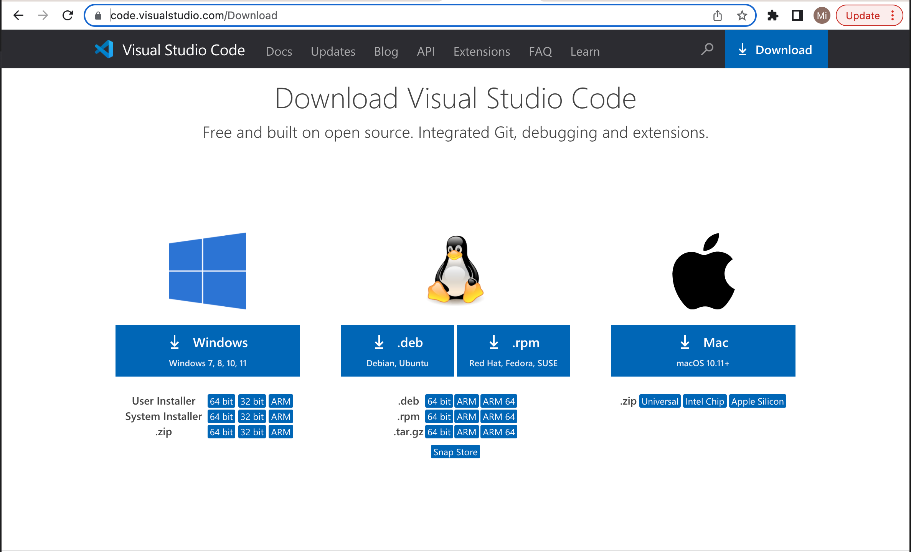

Once VSCode is downloaded it should look something like the image below.

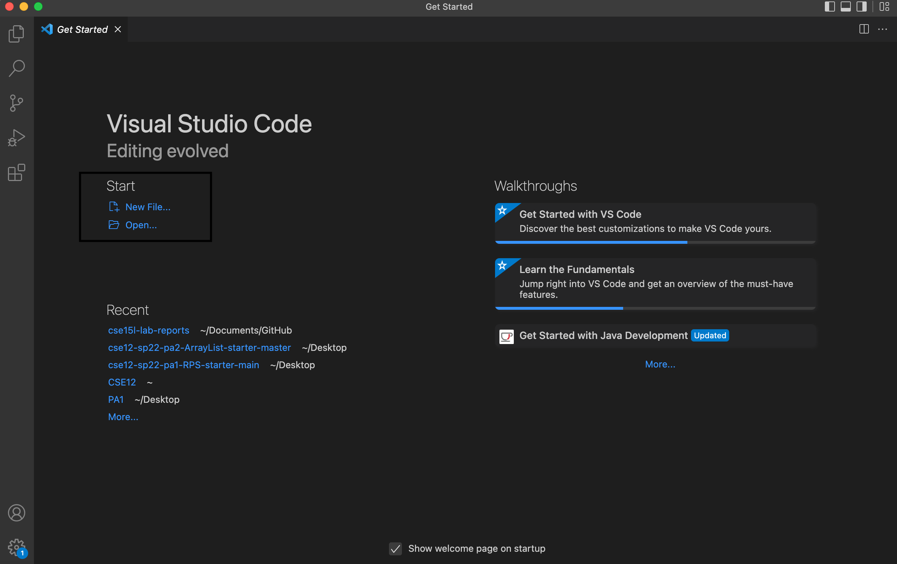

For windows there is an additonal preparation step: downloading [OpenSSH](https://docs.microsoft.com/en-us/windows-server/administration/openssh/openssh_install_firstuse) in order for remote access to a computer.

This tutorial is for accessing CSE15L's course therefore find the  personal course specific account username information [here](https://sdacs.ucsd.edu/~icc/index.php)

The username should be in this form : **cs15lsp22???@ieng6.ucsd.edu**. Replace the ??? with unique letters. Additonally a password reset has to be made. Here is the [link](https://cdn-uploads.piazza.com/paste/ktv2gnof3sx5bf/181c3cb053df5cf1ccaf0457f56f12a2e5aa90b139aef8c2ea8fcc590f02fadf/How-to-Reset-your-Password.pdf) to the specfic directions.

### **Remotely connecting**

On VSCode open a terminal and type in `ssh cs15lsp22???@ieng6.ucsd.edu`

if logging on for the first time there will be a message: `The authenticity of host 'ieng6.ucsd.edu (128.54.70.227)' can't be established.
RSA key fingerprint is SHA256:ksruYwhnYH+sySHnHAtLUHngrPEyZTDl/1x99wUQcec.
Are you sure you want to continue connecting (yes/no/[fingerprint])?`

type `yes`. Then there will be a prompt for entering the password. The image below is what the terminal should look like after successfully logging in.

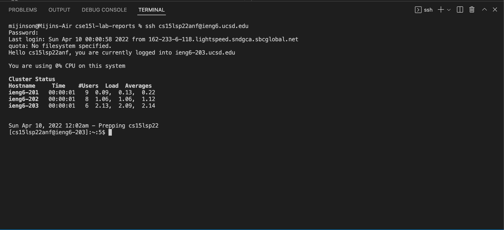

*NOTES* 

the password will be invisible.

To logout use control D or command exit

ssh stands for secured shell and allows secure connection to a server.

### **Practicing commands**

Here is a mini guide to some useful commands:

`ls` lists all the files in the directory

`mkdir name` creates a new directory

`cd name` leads to that directory

`cd` or `cd ~` leads to the home directory

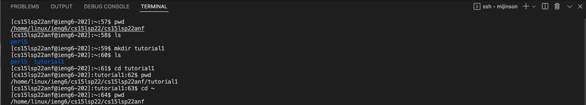

`ls -lat` lists long files and hidden files existing in increasing time order `ls -l`, `ls -a`, `ls -t` commands perform the same task just one step at a time

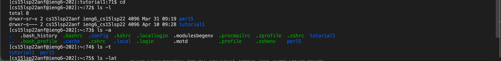

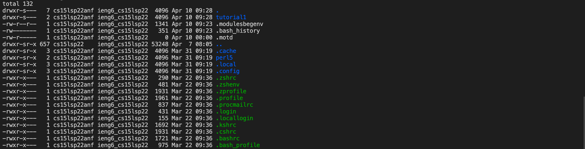

cp copies content from one file to another file in the format *cp source destination*

`touch` adds a file to a directory

`rm name` removes files `rmdir name` removes directories

`echo "string" > filename` adds the string to the file

`cat filename` prints the contents of the file

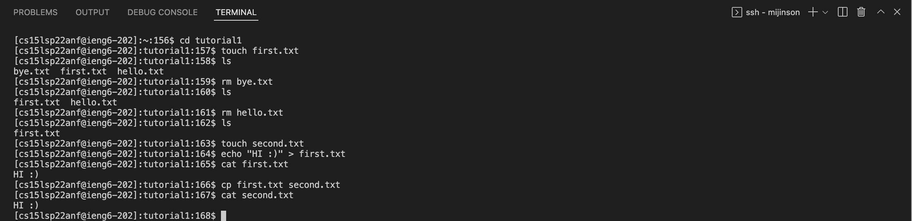

### **Moving files with scp**

using `scp` allows the client to copy a file on their device to the remote computer and run that file on this remote computer.

create a file called WhereAmI.java
and insert the following code :
`class WhereAmI {
  public static void main(String[] args) {
    System.out.println(System.getProperty("os.name"));
    System.out.println(System.getProperty("user.name"));
    System.out.println(System.getProperty("user.home"));
    System.out.println(System.getProperty("user.dir"));
  }
}`

run the file on terminal using `javac` and `java`
then type `scp WhereAmI.java cs15lsp22zz@ieng6.ucsd.edu:~/` in your command 

login and then use `ssh` to sign in.
now run javac and java (this time its running on the remote computer)

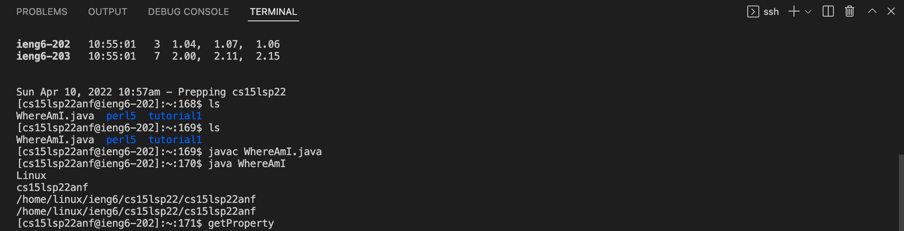

*Note* the `getProperty` method works differently for the client and for the server.

* **Setting SSH Keys**

`ssh-keygen` allows the user to login into the remote computer without having to type in the account password everytime.

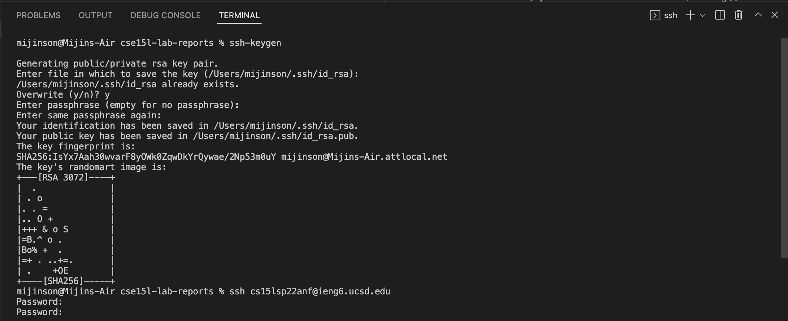
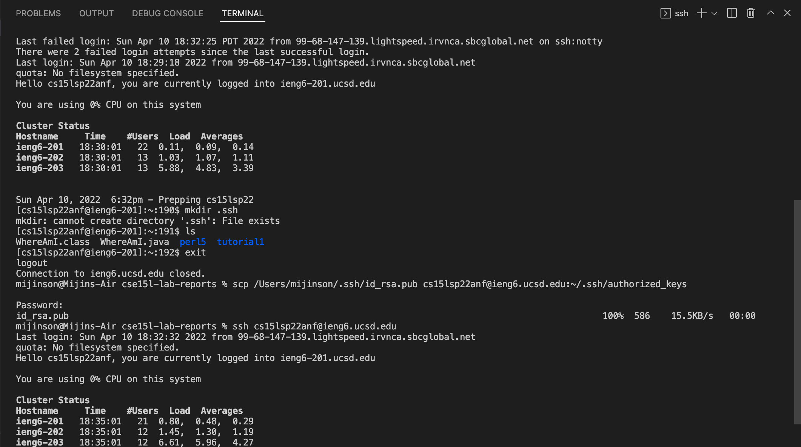

on the client device use the `ssh-keygen` hit enter until it says Your identification has been saved in `/Users/<user-name>/.ssh/id_rsa.`

if using windows type `ssh-keygen -t ed25519`

next type `ssh cs15lsp22zz@ieng6.ucsd.edu` to login into the remote computer

make a new directory and then log out

`mkdir .ssh`

`exit`

now on the client device type the code below. the username is the device user name and then replace the zz in the sever name to the unique letters.

`scp /Users/<user-name>/.ssh/id_rsa.pub cs15lsp22zz@ieng6.ucsd.edu:~/.ssh/authorized_keys`

### **Optimizing Remote Running**

us semicolons `;` to run mutiple commands and use ssh keys to skip the password step to edit a file on the client device and copy that to the remote computer and run on the remote computer in less steps.

Here what I came up with:
run the `ssh` key and `ssh` login, then use `scp` to copy the file over at once
then on the second time run the file on the remote computer using `javac filename.java` and `java filename`.

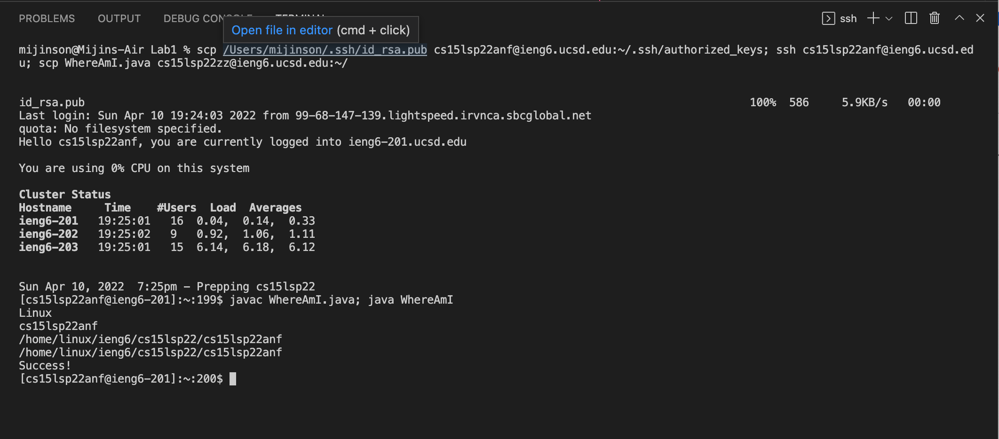

