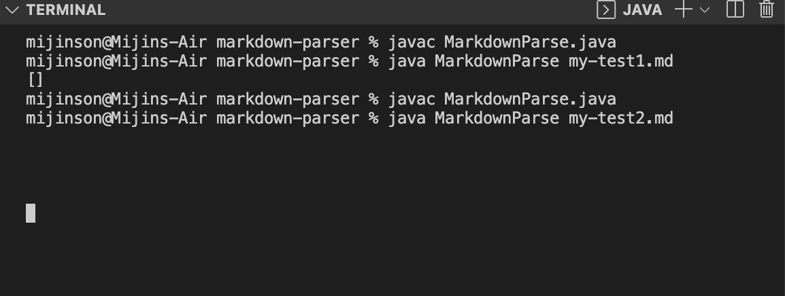
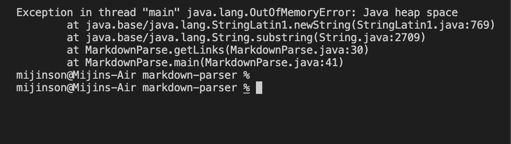
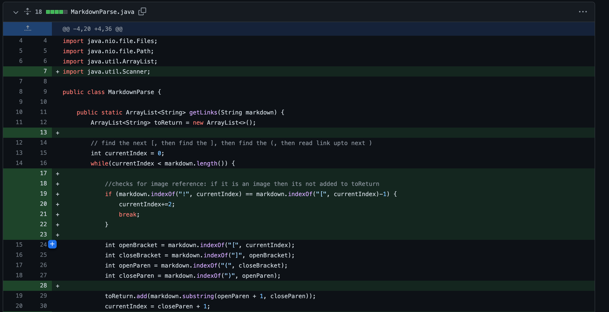
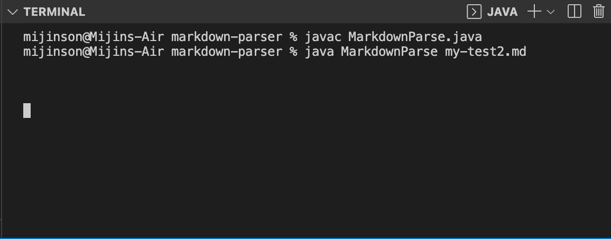
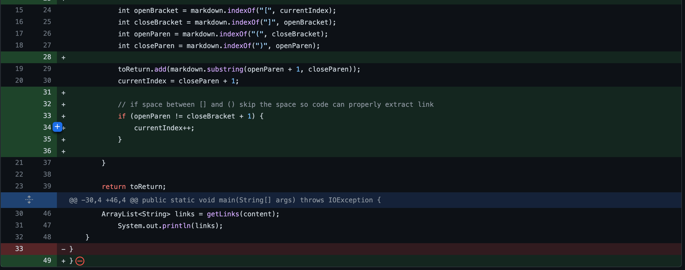
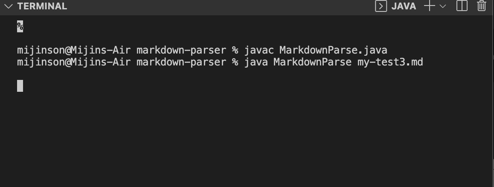
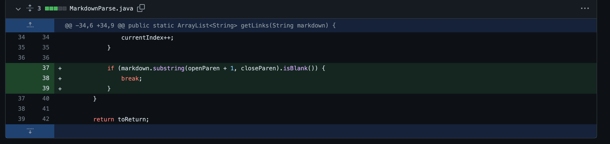

# Debugging
## Understanding the relationship between bugs and symptoms

### **Example 1: Testing MarkdownParse get links method using an image reference**

Prompt: “Write a program that takes a markdown file as a command line argument and then prints out all of the URLs of the links (but not of images) in that file.”

Goal: to fix the code in MarkdownParse so that there is no error and the image reference is not added to the list of links

[link to failure-inducing test case file](https://github.com/mijinson/markdown-parser/blob/main/my-test1.md)

BUG: the original code does not account for image refrences.

*note* there are many other bugs, but this test focuses on just one of them

SYMPTOM: infinite loop (crashes then loads a OutOfMemory error)

The symptom of the infinte loop gives a hint of where to look for the bug in the code. In this case there is a bug in the while loop. Additonally it is important to understand the failure-inducing test case, then what the desired output is (according to prompt images should not printed; therefore `[]` should be the output). Now there is sufficent information to debug.

Code added in while loop to account for image reference

### **Example 2: Testing MarkdownParse get links method with an improper formatting for creating a link**

Prompt: “Write a program that takes a markdown file as a command line argument and then prints out all of the URLs of the links (but not of images) in that file.”

Goal: to fix the code in MarkdownParse so that the link gets added to the list and gets printed out regardless of the incorrect format (assuming the link is correct)

[link to failure-inducing test case file](https://github.com/mijinson/markdown-parser/blob/main/my-test2.md)

BUG: the initial code does not account for incorrect formatting when creating a link. There are multiple possibilites, but one focus is a space between the [] & ()

*note* there are many other bugs, but this test focuses on just one of them

SYMPTOM: infinite loop (crashes then loads a OutOfMemory error)

Similar to the first example, the symptom is an infinite loop and the bug can be found in the while loop; However, the bug is a little different from the first example, and the goal is also different. Fixing the bug as a very similar process, but this time the link should be printed out. It should look something like this: `[https://something.com)]`

Code added in while loop to print correct link regardless of basic formatting error

### **Example 3: Testing MarkdownParse get links method with no link**

Prompt: “Write a program that takes a markdown file as a command line argument and then prints out all of the URLs of the links (but not of images) in that file.”

Goal: to fix the code in MarkdownParse so that there is no error and the list prints an empty list `[]` 

[link to failure-inducing test case file](https://github.com/mijinson/markdown-parser/blob/main/my-test3.md)

BUG: the initial code does not account when there is no link provided.

*note* there are many other bugs, but this test focuses on just one of them

SYMPTOM: infinite loop (crashes then loads a OutOfMemory error)

Although the bug, symptom and the expected output for this example and the first one is similar, the failure-inducing tests are different and the code added for the first example failed to address the bug in this example. based on the symptom there is a bug in the while loop, but there is a different issue with the code.

Code added in while loop to print empty list without causing an infinite loop.

