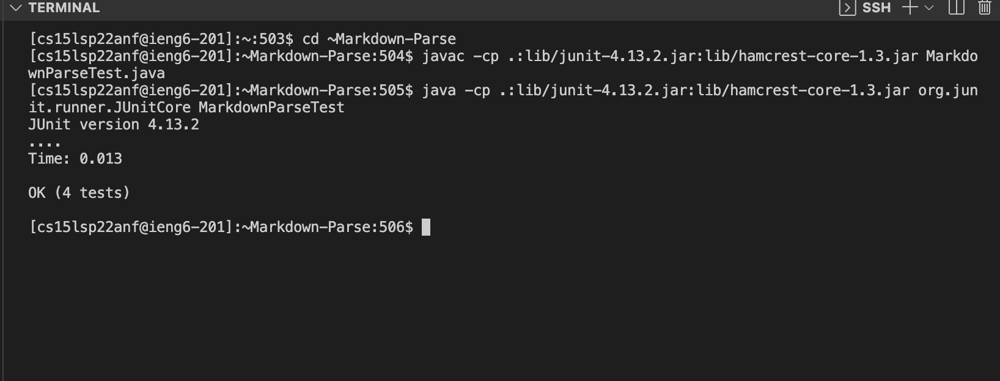

# Working on ieng6 Server

## Streamlining ssh Configuration
### **Log into the ieng6 server using an alias username and no password**

Steps:

1) make sure ssh keys are set up refer to lab report 1 Remote Access Tutorial under setting SSH Keys section.

2) Log into the ieng6 server using `ssh cs15lsp22zzz@ieng6.ucsd.edu` then use `cd .ssh` to go to the correct directory where the ssk keys are stored and where the config file will be stored. Add a file config in the directory using `touch config`. The image below uses the command `ls` to confirm all files are present in the .ssh directory.

IMPORTANT NOTE: to find the files created in the .ssh make sure to look in the correct path locations.
example: Users/username/.ssh/config.

3) In the config file add the following lines of code shown in image.

4) Next to Host the ieng6 can be replaced with any alias. For instance ucsd. Now type in terminal `ssh alias` alias is either ieng6 or can be changed to any name replaced after Host.

The `scp` command can now also work using the alias name instead of the long course specific username.

refer to image below

## Setup Github Access from ieng6

### **Running git commands to commit changes and push changes to github on the ieng6 server**

Preparation:

make sure repository to work with is cloned onto local machine.

log into the ieng6 server and `cd .ssh` then `ls` to check if keys exist already, if not generate a ssh key to use for github access using `ssh-keygen -t ed25519 -C your_email@example.com`
press enter to save key to default location
now add the ssh key to the ssh-agent using `eval "$(ssh-agent -s)` then` ssh-add -K ~/.ssh/id_ed25519`

now use `git remote -v` to check that the link to the repository is ssh link if not run the following `git remote set-url origin <put ssh URL here>` after going on to github.com and copying the ssh link to the repository.

Additonally, using `cat >config` add the following into the file: 

    Host *
        AddKeysToAgent yes
        UseKeychain yes
        IdentityFile ~/.ssh/id_ed25519

Here are screenshots of where the proper public and private keys are stored.

The private key is stored in id_ed25519

Now add the public key to github. go to profile, settings then access on the left side and click SSH and GPG keys to add a new ssh key. To access the key information use `cat id_ed25519` which is the file where key is stored, and copy the content.

Once the key is added on github the page should look like the image below.

Running git commands:

NOTE: all of this is done logged on the ieng6 server

* `cd` into the repository i.e. ~Markdown_Parse
* Pick a file to edit i.e. gitTest.txt. file is initally empty
* To add content into the file use `cat >gitTest.txt`. This should allow for space to type content in. when finished use control D
* Use `git add gitTest.txt` to stage commit then `git status` to check that file is ready to commit
* Use `git commit -m "commit message"` to commit changes
* To push the changes to the repository on github use `git push origin main`

Refer to image below for visual representation of process.
Additionally, here is the link to the resulting commit.

[Commit_Results](https://github.com/mijinson/markdown-parser/blob/main/gitTest.txt)

## Copy whole directories with scp -r

### one efficent way to copy whole directories and run tests on ieng6

To copy whole directories using scp recursively call the follwing line of code in the local machine:

`scp -r *.java *.md lib/ ucsd.edu:~Markdown-Parse`

What the code does above is copy the entire directory ~Markdown-Parse from the local machine and copies it over to the ieng6 server. This allows acess to all files in the directory.

A semicolon `;` can be used to run all commands in one line (copying directory, logging into server, running junit test on server).

Heres what running junit tests logged into server looks like.

Heres what running all commands in one line looks like.

