# Markdown-Parser Work

## Testing two different MarkdownParse methods using three provided input files and keeping clean coding in mind

MarkdownParse (own): [Repository Link](https://github.com/mijinson/markdown-parser)

MakdownParse (peers): [Repository Link](https://github.com/tcarman/markdown-parser)

### **Snippet 1:** 

Preview of input file on commonmark.js dingus
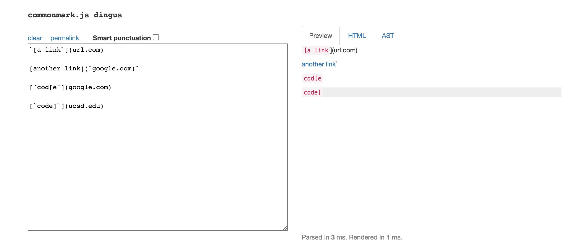
clickable links: google.com, 'google.com, ucsd.edu

**MarkdownParse - Own:**

test
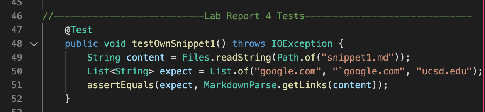

output
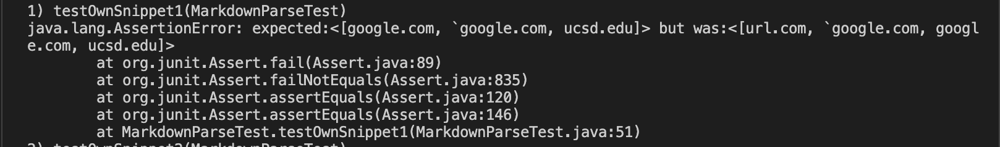

When snippet 1 is the input for the Markdown Parse method the expected output should be [google.com, 'google.com, ucsd.edu] but my output also includes the url.com. There should be a way to fix this using less than ten lines of code. There just needs to be a case where it checks that the start point is always a bracket, if not break out of the loop becuase in the link for url.com there is a tick mark before the opening bracket and it cant be made into a link as seen on preview.

**MarkdownParse - Peers:**

test
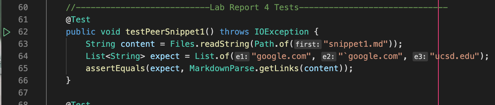

output
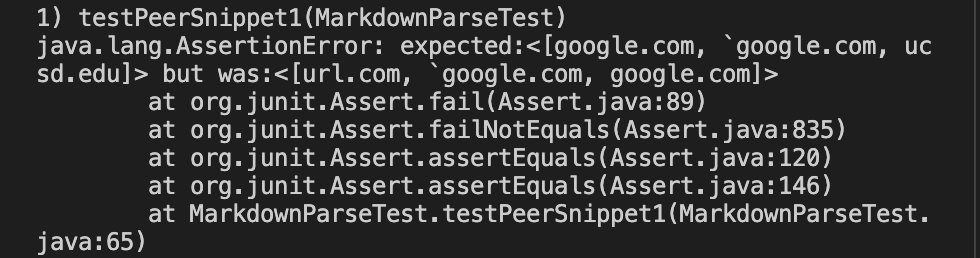

When snippet 1 is the input for the Markdown Parse method the expected remains the same, but in this case the output had two problems: it included the url.com but it also excluded the ucsd.edu. In this case it could lead to going over 10 lines of code to fix this error becuase there has to be code for adressing two problems and the ucsd link not being added is a bit more complicated to fix.

### **Snippet 2:** 

Preview of input file on commonmark.js dingus
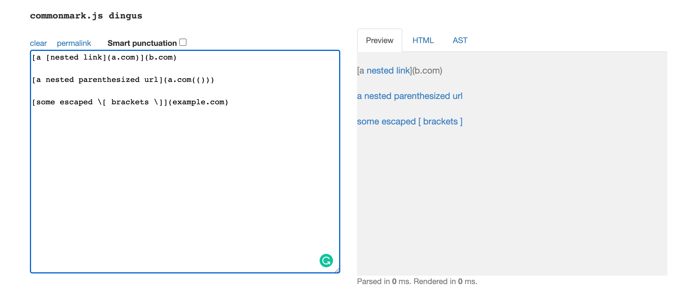
clickable links: a.com, a.com(()), example.com

**MarkdownParse - Own:**

test
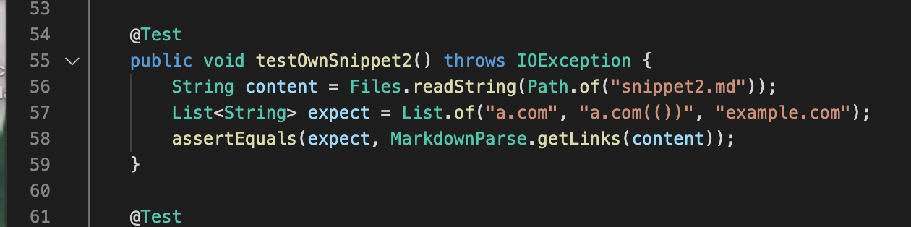

output
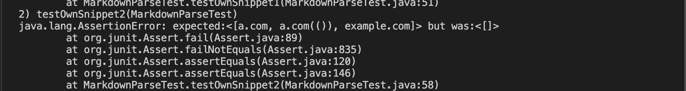

When snippet 2 is passed in as the input the expected is [a.com, a.com(()), example.com] but the output was []. This will require more than ten lines of code change becuase the current method is desinged to exclude any links with strange format issues, but in this assignment it is supposed to get the links regardless if the commonmark sees the code as a link. But this is also in additon to cases for the strange format that needs to be added.

**MarkdownParse - Peers:**

test
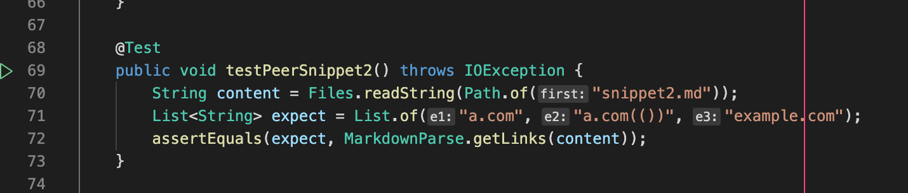

output
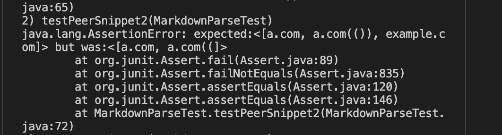

When snippet 2 is passed in as the input the expected remains the same as before, but the output had a few different problems. The name of the link for a.com(()) is missing parts and the example.com is excluded. This is going to require more than ten lines of code change becuase again there is two problems, but also both problems are going to require signifcant change.

### **Snippet 3:** 

Preview of input file on commonmark.js dingus
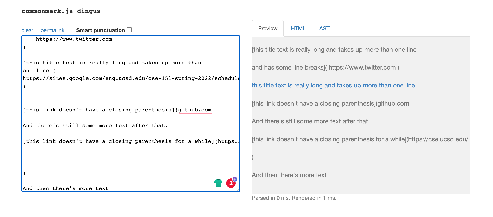
clickable links: https://sites.google.com/eng.ucsd.edu/cse-15l-spring-2022/schedule

**MarkdownParse - Own:**

test
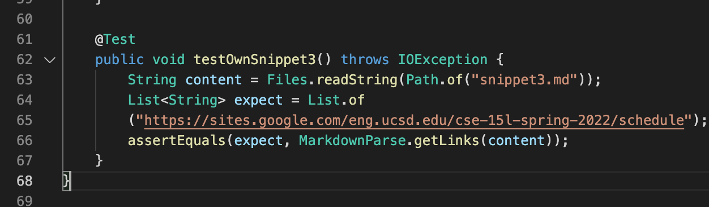

output
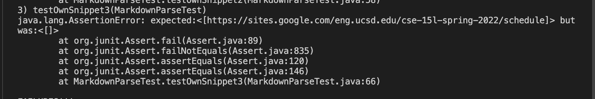

When snippet 3 is passed in as input for the method the expected is [https://sites.google.com/eng.ucsd.edu/cse-15l-spring-2022/schedule] but the output is once again [] becuase the original code was desinged to exclude all links if the format was not prefect. This will require significant changes to the code becuase the change in design. There needs to be code to find where to start extraction of link and end it, while ignoring unecessary charcaters.

**MarkdownParse - Peers:**

test
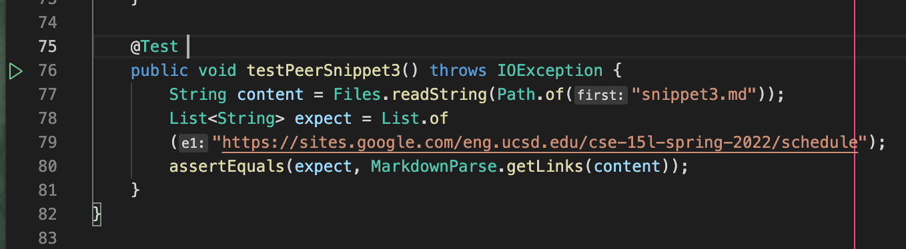

output
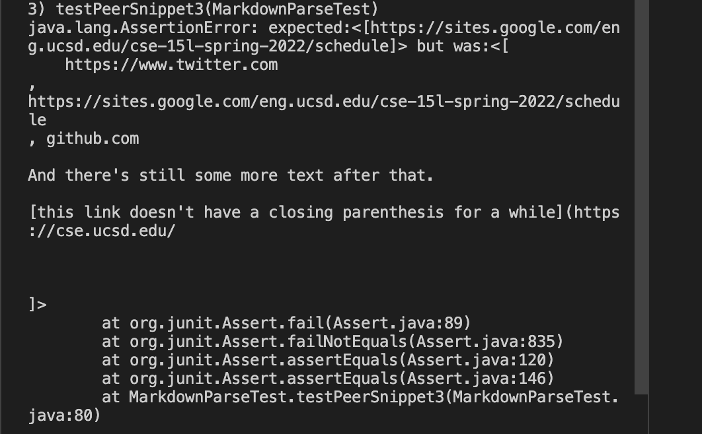

When snippet 3 is passed in as input for the method the expected remains the same  but the output has a problem of printing out more than just the link. This will require more than 10 lines of code change becuase similar to the method above (own) this method has to find a way to extract exactly whats necessary by adjusting start and end points.

