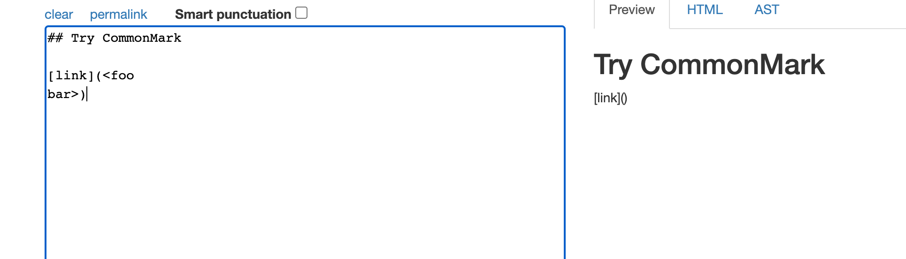

# Comparing MarkdownParse Tests
## Using vimdiff to easily compare test outputs

### **set up**

The Markdown-Parse provided and the My lab peer's Markdown-Parse implementations are going to be compared
Credit: Link to [provided](https://github.com/nidhidhamnani/markdown-parser) Markdown-Parse & [peers](https://github.com/BellaReal/markdown-parser) Markdown-Parse

Each repository was cloned onto ieng6 remote server. the `tests-files` provided `script.sh` was copied over from the provide Markdown-Parse to the other repositiory (peers). In each repository the `script.sh` was edited using vim to add the file name for each test ran and then new files were made using `bash script.sh > filename.txt` to save the tests ran.

### **Vimdiff**

the following lines of code were typed in:

    vimdiff peers-mp/results2.txt 
    markdown-parser/results.txt

**Picked Tests that had different outcomes:**

**[test-files/418.md](https://github.com/nidhidhamnani/markdown-parser/blob/main/test-files/418.md)**

left: peer right: provided

expected output: [/url]

In this case (418) my peers output is correct and the provided output is incorrect.

**[test-files/490.md](https://github.com/nidhidhamnani/markdown-parser/blob/main/test-files/490.md)**

NOTE: I could not get vimdiff to work again for some reason. The orignal test I picked was also correct so I found a new test by searching manually :(

peer

provided

expected output: []

In this case (490) my peers output is incorrect and the provided output is correct.

I think that the reason for the incorrect output has to do with this part of the code below. Maybe in the second code block in the image below: there should be a code for checking that one valid link is on one line (no new line). the main closing and opening brackets must be on same line. on common mark it can be seen that the example is not a valid link. It contains  but theres a new line and that violates the link structure. The current conditons don't cover this.

