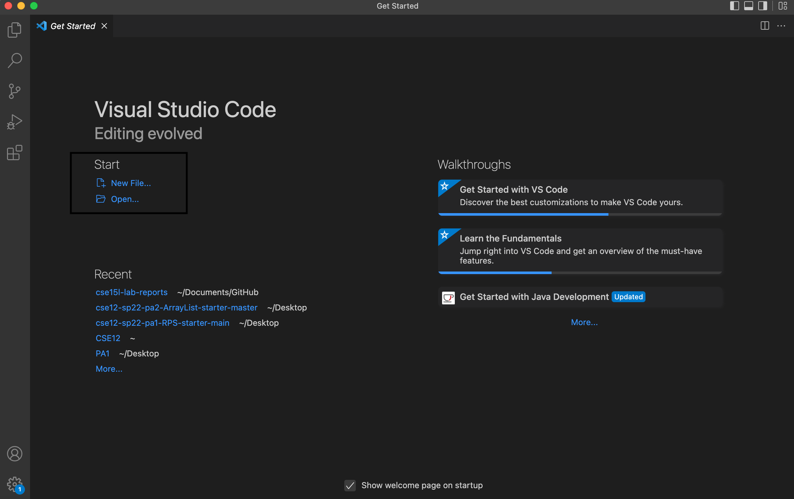

# Remote Access Tutorial

## How to use an IDE to connect to a remote computer

* Getting started

Click the link to the website and download VSCode IDE. the correct version for the operating system that will be used. [link](https://code.visualstudio.com/Download)

Once VSCode is downloaded open/create a new folder or create a new file by clicking on what is in the black box below

For windows there is an additonal preparation step: downloading [OpenSSH](https://docs.microsoft.com/en-us/windows-server/administration/openssh/openssh_install_firstuse) in order for remote access to a computer.

This tutorial is for accessing CSE15L's course therefore find the  personal course specific account username information [here](https://sdacs.ucsd.edu/~icc/index.php)

The username should be in this form : **cs15lsp22??@ieng6.ucsd.edu**. Replace the ?? with unique letters.
